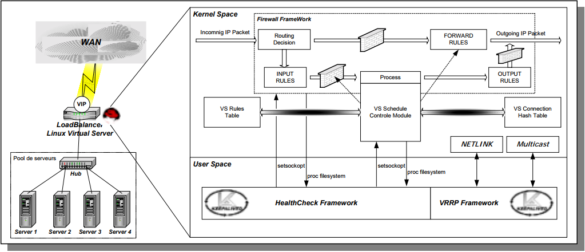
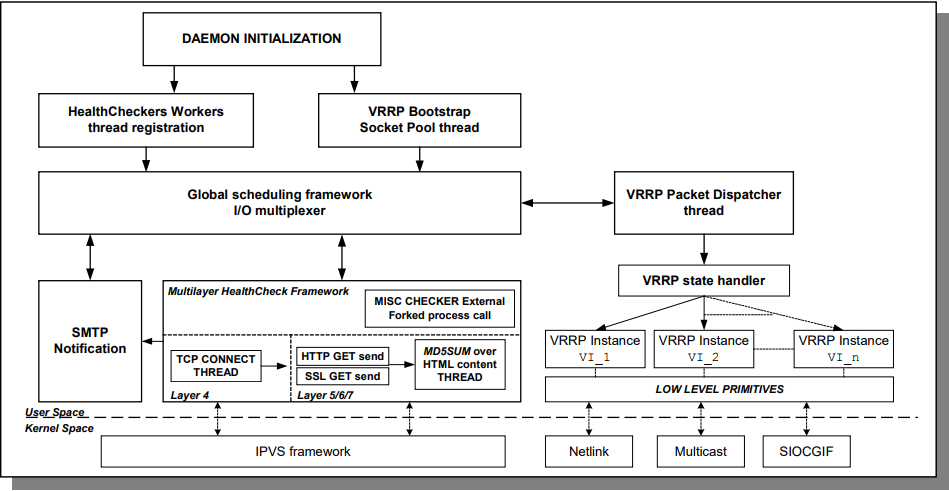

# Tìm hiểu sâu về keepalived

## Mục lục

[1. Giới thiệu](#1)

[2. Các thuật ngữ](#2)

[3. Cấu trúc, cơ chế hoạt động](#3)

  - [3.1 Cấu trúc tổng quan](#3.1)
  - [3.2 Cấu trúc chi tiết](#3.2)

[4. Cấu hình keepalived](#4)
  - [4.1 Global definitions](#4.1)
  - [4.2 Virtual server definitions](#4.2)
  - [4.3 VRRP Instance definitions](#4.3)

-----------

<a name="1"></a>
## 1. Giới thiệu

Khi thiết kế một load balancing topology, cần quan tâm đặc biệt tới 2 yếu tố:

- Tính sẵn sàng của các real servers bằng health checks
- Tính sẵn sàng của load balancer sử dụng failover protocol

Như vậy ngoài việc giám sát các real servers thì việc đảm bảo load balancer vận hành ổn định cũng cần được chú trọng.

keepalived sinh ra để giải quyết điều này, nó sử dụng một health-checks framework rất mạnh sử dụng Hot Standby protocol. framework này có thể làm việc với  Linux Virtual Server (LVS) framework để quản lí LVS real server pools.

<a name="2"></a>
## 2. Các thuật ngữ

LVS (Linux Virtual Server) là một thành phần được thêm vào kernel của linux để hỗ trợ tính năng load balancing.

LVS hoạt động như network bridge (sử dụng NAT) để cân bằng tải các luồng TCP/UDP. Các thành phần của LVS router:

- WAN interface
- LAN interface
- Linux kernel

Các thành phần của LVS:

- VIP: Virtual IP, dùng để client truy cập
- Real server :  các server có nhiệm vụ nhận requests từ client
- Server pool: Một khu chứa các real servers
- Virtual server: Điểm truy cập tới server pool
- Virtual Service: TCP/UDP service gắn liền với VIP

Các thành phần của VRRP:

- VRRP : Giao thức dùng cho việc chuyển đổi giữa các máy dự phòng/ảo hóa.
- VRRP Instance: một VRRP Instance có thể dùng để backup cho 1 hoặc nhiều VRRP Instance khác.
- IP Address owner: VRRP Instance có IP của interface thật. Đây là VRRP Instance có nhiệm vụ trả lời lại các packets
- MASTER state: VRRP Instance có nhiệm vụ chuyển tiếp tới các địa chỉ IP liên quan tới nó
- BACKUP state : làm nhiệm vụ của VRRP Instance MASTER khi nó fail
- Real Load balancer: một LVS điều khiển 1 hoặc nhiều VRRP Instances.
- Virtual Load balancer: danh sác các  Real Load balancers.

<a name="3"></a>
## 3. Cấu trúc, cơ chế hoạt động

<a name="3.1"></a>
### 3.1 Cấu trúc tổng quan



kiến trúc của keepalived làm việc với 4 thành phần trong linux kernel:

- LVS kernel framework
- Netfilter framework
- NETLINK Interface: dùng để thêm/xóa VRRP IP cho  Hot Standby protocol (VRRP)
- MULTICAST

<a name="3.2"></a>
### 3.2 Cấu trúc chi tiết



Ta có thể thấy 2 thành phần chính đó là:

- Health-checker worker threads: mỗi một health-check được đăng kí với global scheduling framework. Nó sẽ đảm đương nhiệm vụ này bằng cách sử dụng Keepalived health-check framework.  health-check framework chứa 3 checkers:
  - TCP_CHECK: Hoạt động ở layer 4. Nếu remote server không trả lời thì server sẽ bị loại khỏi server pool.
  - HTTP_GET: Hoạt động ở layer 5. Thực hiện GET HTTP với các url. Kết quả sẽ được tổng hợp lại sử dụng MD5 algorithm nếu nó ko match với giá trị mong muốn, server sẽ bị loại khỏi server pool. Module này hoạt động hiệu quả khi server bạn chạy nhiều hơn một ứng dụng.
  - SSL_GET: giống với HTTP_GET nhưng sử dụng ssl connection để kết nối tới server.
  - MISC_CHECK: cho phép người dùng tự tạo script để chạy như là Health-checker. Kết quả buộc phải là 0 hoặc 1.

- VRRP Packet Dispatcher: Phân tách I/O  để quản lí các VRRP Instance

Hai thành phần này sử dụng những công cụ sau:

- SMTP notification: cho phép keepalived gửi cảnh báo
- IPVS framework:  LVS kernel interface cho việc quản lí real server pool
- Netlink:  Kernel routing interface cho VRRP. Quản lí VRRP VIP
- Multicast: Dùng để gửi VRRP adverts
- NETFILTER
- SYSLOG

<a name="4"></a>
## 4. Cấu hình keepalived

<a name="4.1"></a>
### 4.1 Global definitions

``` sh
global_defs {
  notification_email {
    email
    email
  }
  notification_email_from email
  smtp_server host
  smtp_connect_timeout num
  lvs_id string
}
```

- `global_defs` : cho biết đây là block cấu hình của global def
- `notification_email` : email nhận được thông báo
- `notification_email_from` : email được sử dụng khi xử lí câu lệnh “MAIL FROM:” SMTP
- `smtp_server` : SMTP server dùng để gửi mail thông báo
- `smtp_connection_timeout` : timeout cho tiến trình xử lí SMTP

<a name="4.2"></a>
### 4.2 Virtual server definitions

``` sh
virtual_server (@IP PORT)|(fwmark num) {
    delay_loop num
    lb_algo rr|wrr|lc|wlc|sh|dh|lblc
    lb_kind NAT|DR|TUN
    (nat_mask @IP)
    persistence_timeout num
    persistence_granularity @IP
    virtualhost string
    protocol TCP|UDP

    sorry_server @IP PORT

    real_server @IP PORT {
      weight num
      TCP_CHECK {
        connect_port num
        connect_timeout num
      }
    }
    real_server @IP PORT {
      weight num
      MISC_CHECK {
        misc_path /path_to_script/script.sh
        (or misc_path “/path_to_script/script.sh <arg_list>”)
      }
    }
    real_server @IP PORT {
        weight num
        HTTP_GET|SSL_GET {
            url { # You can add multiple url block
              path alphanum
              digest alphanum
            }
            connect_port num
            connect_timeout num
            nb_get_retry num
            delay_before_retry num
        }
    }
}
```

- `delay_loop` : số giây giữa các lần check
- `lb_algo` : load balancing algorithm (rr|wrr|lc|wlc…)
- `lb_kind` : method dùng để forwarding (NAT|DR|TUN)
- `persistence_timeout` : thời gian timeout cho các persistence connection
- `Virtualhost` : HTTP virtualhost để dùng cho  HTTP|SSL_GET
- `protocol` :  (TCP|UDP)
- `sorry_server` : server được add vào pool nếu mọi server đều bị down
- `Weight` : trọng số cho load balancing
- `TCP_CHECK` : check bằng tcp connect
- `MISC_CHECK` : check bằng user defined script
- `misc_path` : Đường dẫn tới script
- `HTTP_GET` : check bằng HTTP GET request
- `SSL_GET` : check bằng SSL GET request

<a name="4.3"></a>
### 4.3 VRRP Instance definitions

``` sh
vrrp_sync_group string {
  group {
    string
    string
  }
  notify_master /path_to_script/script_master.sh
      (or notify_master “/path_to_script/script_master.sh <arg_list>”)
  notify_backup /path_to_script/script_backup.sh
      (or notify_backup “/path_to_script/script_backup.sh <arg_list>”)
  notify_fault /path_to_script/script_fault.sh
      (or notify_fault “/path_to_script/script_fault.sh <arg_list>”)
}
vrrp_instance string {
  state MASTER|BACKUP
  interface string
  mcast_src_ip @IP
  lvs_sync_daemon_interface string
  virtual_router_id num
  priority num
  advert_int num
  smtp_alert
  authentication {
    auth_type PASS|AH
    auth_pass string
  }
  virtual_ipaddress { # Block limited to 20 IP addresses
    @IP
    @IP
    @IP
  }
  virtual_ipaddress_excluded { # Unlimited IP addresses number
    @IP
    @IP
    @IP
  }
  notify_master /path_to_script/script_master.sh
    (or notify_master “/path_to_script/script_master.sh <arg_list>”)
  notify_backup /path_to_script/script_backup.sh
    (or notify_backup “/path_to_script/script_backup.sh <arg_list>”)
  notify_fault /path_to_script/script_fault.sh
    (or notify_fault “/path_to_script/script_fault.sh <arg_list>”)
}
```

- `State` : trạng thái của Instance
- `Interface` : Interface mà Instance đang chạy
- `mcast_src_ip` : địa chỉ Multicast
- `lvs_sync_daemon_inteface` : Interface cho LVS sync_daemon
- `Virtual_router_id` :  VRRP router id
- `Priority` : thứ tự ưu tiên trong VRRP router
- `advert_int` : số  advertisement interval trong 1 giây
- `smtp_aler` : kích hoạt thông báo SMTP cho MASTER
- `authentication` :  VRRP authentication
- `virtual_ipaddress` : VRRP VIP


**Link tham khảo:**

http://www.keepalived.org/pdf/UserGuide.pdf
