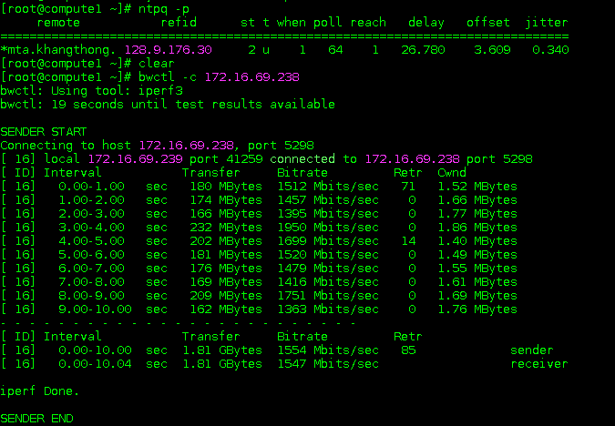

# Tìm hiểu Bandwidth Test Controller (BWCTL)

## Mục lục

[1. bwctl là gì và để làm gì?](#def)

[2. Một số options phổ biến](#opts)

[3. Lab cài đặt và sử dụng bwctl trên CentOS 7](#lab)

-----------

## 1. bwctl là gì và để làm gì?

BWCTL là một công cụ dòng lệnh sử dụng một loạt các công cụ đo lường network như Iperf, Iperf3, Nuttcp, Ping, Traceroute, Tracepath, và OWAMP để đo băng thông TCP tối đa với một loạt các tùy chọn điều chỉnh khác nhau như sự trễ, tỉ lệ mất gói tin,... Mặc định, bwctl sẽ dùng iperf.

bwctl client sẽ liên lạc với một máy chủ để thực hiện bài test. bwctl server sẽ quản lí và sắp xếp các tài nguyên trên host mà nó chạy.

**Các tính năng chính**

- Hỗ trợ Iperf, Iperf3 và Nuttcp tests.
- Hỗ trợ ping tests
- Hỗ trợ OWAMP (One-Way Latency) tests.
- Hỗ trợ Traceroute và Tracepath tests
- Hỗ trợ ipv6 mà không cần thêm tùy chọn nào
- Dữ liệu từ cả hai phía được trả lại vì thế có thể so sánh kết quả giữa hai phía
- Không yêu cầu local BWCTL server,  BWCTL client sẽ kiểm tra xem có local BWCTL server hay không và sử dụng nó nếu có.
- Port ranges cho kết nối có thể được chỉ định
- Giới hạn số lượng test có thể chạy

**Yêu cầu**

- BWCTL server yêu cầu NTP được sử dụng để cả hay phía đều có cùng scheduled time window

## 2. Một số options phổ biến

| Options | Descriptions |
|---------|--------------|
| -4, --ipv4 | Chỉ dùng ipv4 |
| -6, --ipv6 | Chỉ dùng ipv6 |
| -c, --receiver | Chỉ định host chạy Iperf, Iperf3 or Nuttcp server |
| -s, --sender | Chỉ định host chạy Iperf, Iperf3 or Nuttcp client |
| -T, --tool | Chỉ định tool sử dụng ( iperf, iperf3, nuttcp) |
| -b, --bandwidth  | Giới hạn bandwidth với UDP |
| -l, --buffer_length | độ dài của read/write buffers (bytes). Mặc định 8 KB TCP, 1470 bytes UDP |
| -t,--test_duration | Thời gian cho bài test, mặc định là 10 giây |
| -u, --udp | Dùng UDP test, vì mặc định là dùng TCP |
| -h, --help | Show help message |
| -p, --print | In kết quả ra file |
| -V, --version | Phiên bản |

## 3. Lab cài đặt và sử dụng bwctl trên CentOS 7

**Cài đặt**

Cài đặt EPEL RPM

`rpm -hUv https://dl.fedoraproject.org/pub/epel/epel-release-latest-7.noarch.rpm`

Cài đặt Internet2-repo RPM

`rpm -hUv http://software.internet2.edu/rpms/el7/x86_64/main/RPMS/Internet2-repo-0.7-1.noarch.rpm`

Refresh yum’s cache

`yum clean all`

Cài đặt bwctl

`yum install bwctl -y`

Cài đặt ntp

`yum install ntp -y`

Chỉnh sửa file `/etc/ntp.conf` để cả hai cùng trỏ về một ntp server

`server vn.pool.ntp.org iburst`

Khởi động lại dịch vụ ntp

`systemctl restart ntpd`

Kiểm tra lại

`ntpq -p`

**Một số câu lệnh thông dụng**

`bwctl -c somehost.example.com`

Chạy test mặc định với TCP trong vòng 10 giây, máy chạy câu lệnh chính là sender còn receiver là `somehost.example.com`

Kết quả trả về:

`bwctl -x -c somehost.example.com`

Kết quả gần giống với câu lệnh phía trên nhưng nó sẽ có thêm phần kết quả của phía sender

`bwctl -x -c somehost.example.com -s otherhost.example.com`

Giống câu lệnh trên nhưng `otherhost.example.com` mới là sender chứ không phải local

` bwctl -t 30 -T iperf -s somehost.example.com`

30 giây TCP iperf test với somehost.example.com là sender còn local là receiver

`bwctl -I 3600 -R 10 -t 10 -u -b 10m -s somehost.example.com`

10 giây UDP test với sender rate là 10 Mbits/sec từ some-host.example.com tới local.

**Link tham khảo:**

http://docs.perfsonar.net/release_candidates/4.0rc3/install_centos.html

https://software.internet2.edu/bwctl/

https://software.internet2.edu/bwctl/bwctl.man.html
