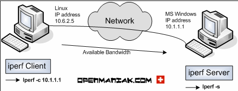
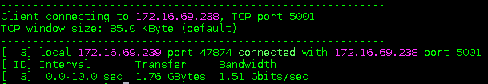
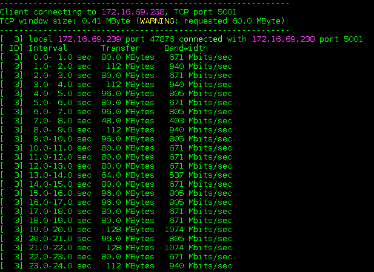
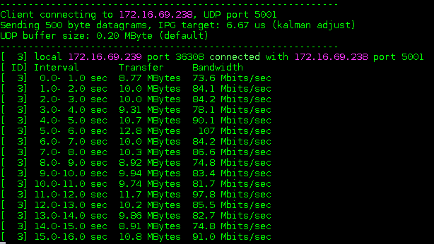

# Tìm hiểu về iperf

## Mục lục

[1. iperf là gì và để làm gì ?](#def)

[2. Những sự thay đổi giữa iperf 2 và iperf 3](#dif)

[3. Những options phổ biến của iperf2 và iperf3](#opts)

[4. Lab cài đặt và test băng thông mạng sử dụng iperf](#lab)

-----------

<a name ="def"></a>
## 1. Iperf là gì và để làm gì ?

Iperf là một công cụ dùng cho việc đo lường tốc độ băng thông tối đa có thể đạt được trên các mạng hỗ trợ giao thức tcp/ip. Nó hỗ trợ điều chỉnh một loạt các thông số khác nhau liên quan tới thời gian, giao thức và buffers. Với mỗi lần test, nó sẽ đều cho ra các bài báo cáo về throughput/bitrate hay số package bị mất...

Iperf hiện có 2 phiên bản là 2 và 3. Iperf 3 đầu tiên được phát triển cho CentOS Linux, FreeBSD, và macOS. Theo thời gian, nó dần hỗ trợ thêm một loạt các hệ điều hành khác như OpenBSD, NetBSD, Android, Solaris...

Iperf3 được phát triển chủ yếu bởi Phòng thí nghiệm Quốc gia ESnet / Lawrence Berkeley. Nó được phát hành tuân thủ theo giấy phép three-clause BSD.

<a name ="dif"></a>
## 2. Những sự thay đổi giữa iperf 2 và iperf 3

**Các tính năng của iperf2 được hỗ trợ trên iperf3**

- Kiểm tra dựa trên giao thức tcp và udp
- Đặt port
- Chỉ ra một số TCP options: No delay, MSS,...
- Đặt bandwith cho udp
- Đặt kích thước socket buffer
- Đặt khoảng thời gian report
- Đặt iPerf buffer
- Test ipv6
- Số lượng bytes chuyển đổi
- Độ dài bài test
- Định dạng của output

**Các tính năng mới**

- Dynamic server, hầu hết các server options trên iperf2 giờ có thể được set từ phía clients
- Kết quả trả về của client/server có thể hoán đổi cho nhau
- iPerf API (libiperf), cung cấp api cho người dùng điều chỉnh các tính năng một các dễ dàng hơn
- Đảo ngược trạng thái test, server sẽ gửi và clients là người nhận
- Tùy chọn hiển thị thông tin output chi tiết hơn
- Tùy chọn cho phép hiển thị output dưới dạng file json
- Đặt số lượng nhân của CPU
- Đặt số lượng blocks packets để truyền đi
- tùy chọn cho phép chỉ sử dụng ipv4 hoặc ipv6
- iperf2 có thể xử lí 1 loạt các request nhưng iperf 3 sẽ chỉ xử lí 1 kết nối trong 1 thời điểm.

**Các tính năng ở iperf2 nhưng không có ở iperf 3**

- Thử nghiệm 2 chiều (Bidirectional testing)
- Dữ liệu truyền từ stdin
- TTL : time-to-live
- Báo cáo dưới dạng các giá trị được ngăn cách nhau bởi dấu phẩy

<a name ="opts"></a>
## 3. Những options phổ biến của iperf2 và iperf3

### 3.1 iperf2

**Các tùy chọn phổ biến**

| Command line option | Description |
|---------------------|-------------|
| -f, --format | format cho output. 'b' = bits/sec, 'B' = Bytes/sec, 'k' = Kbits/sec, 'K' = KBytes/sec, 'm' = Mbits/sec, 'M' = MBytes/sec, 'g' = Gbits/sec, 'G' = GBytes/sec, 'a' = adaptive bits/sec, 'A' = adaptive Bytes/sec |
| -i, --interval | Thời gian gửi báo cáo (mặc định là 0) |
| -l, --len  | Buffer size |
| -p, --port | port mà server lắng nghe và client kết nối tới, giống nhau ở client và server, mặc định là port 5001 |
| -u, --udp | Sử dụng udp |
| -N, --nodelay | sử dụng tùy chọn TCP no delay |
| -h, --help | Tóm tắt các tùy chọn có thể sử dụng |
| -n | Gửi n gói tin với kích thước l |

**Phía server**

| Command line option | Description |
|---------------------|-------------|
| -s, --server | chạy iperf ở mode server |
| -D (from v1.2 or higher) | dùng server như một daemon |
| -R (only for Windows, from v1.2 or higher) | loại bỏ hết các iperf service |
| -o (only for Windows, from v1.2 or higher) | Chuyển output sang 1 file |
| -c, --client | Giới hạn các connections được phép kết nối tới server, không dùng được với UDP |

**Phía client**

| Command line option | Description |
|---------------------|-------------|
| -b, --bandwidth | UDP bandwidth, mặc định là 1 Mbit/sec |
| -c, --client | chạy iperf ở mode client |
| -d, --dualtest | chạy dưới dạng dualtest |
| -n, --num | số lượng buffers để truyền đi, mặc định thì iperf gửi cho 10 giây |
| -t, --time | thời gian truyền dữ liệu, mặc định là 10 giây |
| -L, --listenport | port mà server sẽ kết nối lại tới client |
| -P, --parallel  | số lượng connections kết nối tới server , mặc định là 1 |
| -T, --ttl | sử dụng cho outgoing multicast packets |

### 3.2 iperf3

**Các tùy chọn phổ biến**

| Command line option | Description |
|---------------------|-------------|
| -p, --port | port mà server lắng nghe và client kết nối tới, nên giống nhau ở cả hai đầu client và server. Mặc định là port 5201 |
| -f, --format | format cho output. 'k' = Kbits/sec, 'K' = KBytes/sec, 'm' = Mbits/sec, 'M' = MBytes/sec |
| -i, --interval | Thời gian mà iperf gửi báo cáo cho bạn (mặc định là 0) |
| -A, --affinity  | đặt số lượng cpu core |
| -V, --verbose | output hiển thị nhiều thông tin hơn |
| -J, --json | output dưới dạng file json |
| --logfile | gửi ouput tới logfile |
| -h, --help | hiển thị tóm tắt các tùy chọn |
| -P | Đẩy nhiều luồng song song, phù hợp với stress testing, mặc định là 1 |
| -B | Gán host/interface. Sử dụng khi máy có nhiều interface và bạn chỉ muốn test 1 |
| -n | Gửi n gói tin với kích thước l |

**Phía server**

| Command line option | Description |
|---------------------|-------------|
| -s, --server | chạy iperf ở mode server |
| -D (from v1.2 or higher) | dùng server như một daemon |

**Phía client**

| Command line option | Description |
|---------------------|-------------|
| -c, --client | chạy iperf ở mode client |
| -u, --udp | Sử dụng udp |
| -b, --bandwidth | bandwidth, mặc định là 1 Mbit/sec cho udp, không giới hạn với tcp |
| -t, --time | thời gian truyền dữ liệu, mặc định là 10 giây |
| -n, --num | số lượng buffers để truyền đi, mặc định thì iperf gửi cho 10 giây |
|-R, --reverse | reverse mode, server gửi, client nhận |
| -4, --version4 | chỉ dùng ipv4 |
| -6, --version6 | chỉ dùng ipv6 |

<a name ="lab"></a>
## 4. Lab cài đặt và test băng thông mạng sử dụng iperf

Để cài đặt iperf, sử dụng câu lệnh sau

Trên CentOS

`yum install iperf`

Trên Ubuntu

`apt-get install iperf`

**Mô hình thực hiện bài test**



Để kiểm tra băng thông của mạng ta có thể sử dụng một trong hai giao thức TCP hoặc UDP, nhưng điểm chung giữa hai phương pháp này là đều cần 1 máy làm server để lắng nghe, một máy client kết nối đến giống như hình trên. IPerf sẽ tính toán và đưa ra được băng thông của mạng giữa Server và client.

**Sử dụng TCP**

Cả máy server và client đều cần cài iperf. Nếu sử dụng tham số cổng (-p) thì trên cả Server và client đều phải giống cổng nhau.

Trên phía server

`iperf -s`

Trên phía client

`iperf -c ip-server`

Kết quả sau 10 giây



Ví dụ bài test TCP với Buffer size: 16 MB, Window Size: 60 Mbps, Max segment size 5 trong thời gian 5 phút, kết quả hiển thị dưới dạng mbps

Server:

`iperf -s -P 0 -i 1 -p 5001 -w 60.0m -l 16.0M -f m`

Client:

`iperf -c ip-server -i 1 -p 5001 -w 60.0m -M 1.0K -l 16.0M -f m -t 300`




**Sử dụng UDP**

Trên phía server

`iperf -s -u`

Trên phía client

`iperf -c ip-server -u`


Ví dụ bài test UDP với Bandwidth 600 Mbps Packet size 500 Bytes trong 300s

Server:

`iperf -s -u -P 0 -i 1 -p 5001 -f m`

Client:

`iperf -c ip-server -u -i 1 -p 5001 -l 500B -f m -b 600m -t 300`



**Kiểm tra tốc độ của một cổng mạng**

Để làm việc này ta có thể đẩy tải liên lục bằng UDP tại máy chủ, do UDP truyền file mà không cần phải bắt tay 3 bước như TCP nên ta có thể đẩy UDP liên lục từ client, thay đổi băng thông và quan sát băng thông tối đa mà nó đạt được, đó cũng chính là giới hạn của card mạng.

Giả sử có một máy chủ card ens4 có ip 10.10.10.51 và tôi muốn kiểm tra xem tốc độ ens4 tối đa là bao nhiêu, tôi thực hiện như sau:

``` sh
iperf -c 10.10.10.51 -u -b 100m -t 100 -i 1
iperf -c 10.10.10.51 -u -b 500m -t 100 -i 1
iperf -c 10.10.10.51 -u -b 1g -t 100 -i 1
iperf -c 10.10.10.51 -u -b 2g -t 100 -i 1
```

**Link tham khảo:**

https://iperf.fr/iperf-doc.php

https://github.com/ducnc/iperf

https://github.com/esnet/iperf
