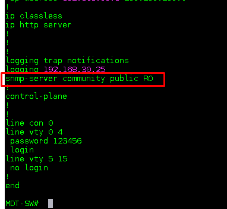
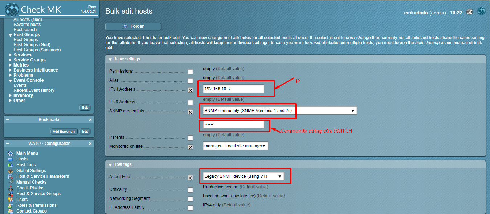
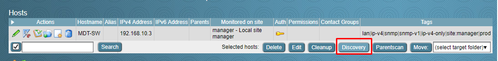
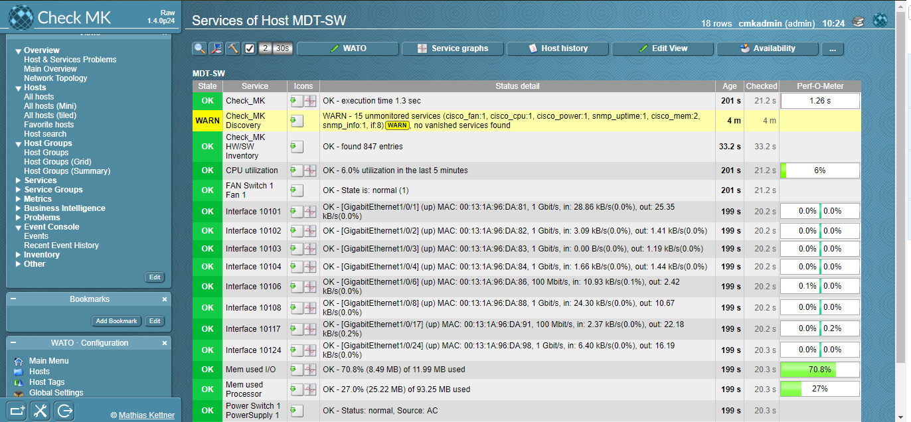

# Hướng dẫn sử dụng check mk để monitor switch

## Yêu cầu

Switch phải hỗ trợ SNMP

## Hướng dẫn cấu hình

Phía switch cấu hình như sau

Trong đó `public` là community string mà ta sẽ sử dụng để cấu hình trên phía checkmk
Lưu ý: Cần đảm bảo checkmk server có quyền truy cập tới SW về mặt network

Ở trên phía checkmk ta khai báo như sau:

Tiến hành `Discovery`

Kết quả

