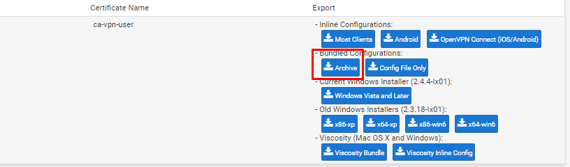
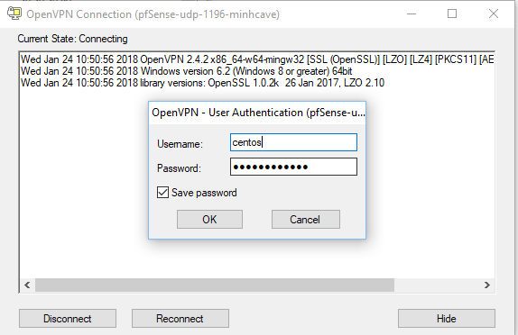
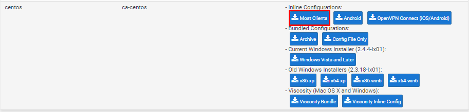
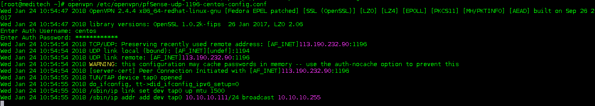
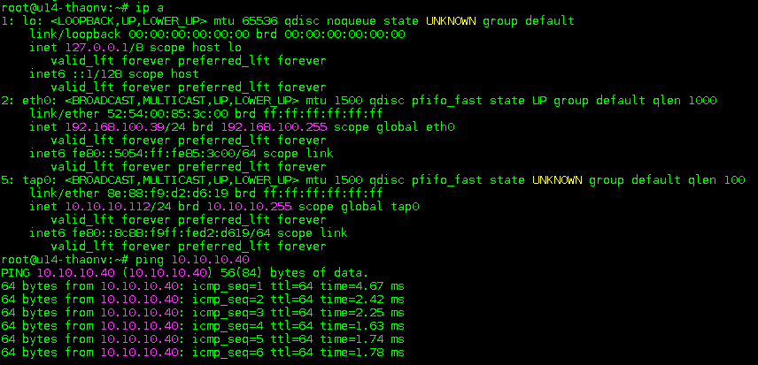

# Hướng dẫn kết nối vpn từ client

## Windows

- Tải về bản cài đặt openvpn client phù hợp với hệ điều hành


- Trong trường hợp máy bạn đã cài sẵn openvpn client, tải về file nén chứa các file xác thực.



- Sau đó giải nén và copy toàn bộ thư mục vào foler `C:\Program Files\OpenVPN`

- Tiến hành kết nối tới server, nhập `username/password` vào



## CentOS 7

- Cài đặt gói openvpn

```
yum install epel-release -y
yum install openvpn -y
```

- Tải về file cấu hình vpn cho client



- Copy vào thư mục `/etc/openvpn/` và đổi tên từ `.ovpn` thành `.conf`

`cp pfSense-udp-1196-centos-config.ovpn /etc/openvpn/pfSense-udp-1196-centos-config.conf`

- Tiến hành kết nối vpn bằng câu lệnh

`openvpn /etc/openvpn/pfSense-udp-1196-centos-config.conf`

- Nhập username và password



- Sang tab mới kiểm tra ip


## Ubuntu 14.04 LTS

- Cài đặt gói openvpn

```
apt-get update
apt-get install openvpn
```

- Tải về gói giải nén

`apt-get install unzip -y`

- Download gói nén chứa các file xác thực


- Giải nén và copy vào thư mục `/etc/openvpn`

```
unzip pfSense-udp-1196-ubuntu-config.zip
cd pfSense-udp-1196-ubuntu
cp pfSense-udp-1196-ubuntu.conf pfSense-udp-1196-ubuntu.p12 pfSense-udp-1196-ubuntu-tls.key /etc/openvpn
```

- Sau khi giải nén ta sẽ có các file

```
pfSense-udp-1196-ubuntu.ovpn
pfSense-udp-1196-ubuntu.p12
pfSense-udp-1196-ubuntu-tls.key
```

- Tiến hành đổi tên file

```
cd /etc/openvpn
mv pfSense-udp-1196-ubuntu.ovpn pfSense-udp-1196-ubuntu.conf
```

- Kết nối và kiểm tra

`openvpn pfSense-udp-1196-ubuntu.conf`

**Note**

Nếu gặp phải lỗi sau

``` sh
Options error: Unrecognized option or missing parameter(s) in pfSense-udp-1196-ubuntu.conf:5: ncp-ciphers (2.3.2)
Use --help for more information.
```

Tiến hành comment lại dòng số 5 trong file cấu hình client (`ncp-ciphers AES-256-GCM:AES-128-GCM`) và kết nối lại.

- Chuyển sang tab khác và kiểm tra ip sau đó ping thử tới các máy có cùng dải mạng LAN


