# Hướng dẫn cấu hình openvpn mode tap

## Mô hình

- Môi trường lab: KVM

## Hướng dẫn cấu hình server

- Truy cập vào giao diện web của pfsense

**Tạo certificate**

- Tại tab System/Certificate Manager/CA, chọn `Add` để thêm một CA mới, CA này sẽ xác thực tất cả các certificate của server VPN và user VPN khi kết nối tới PFSense OpenVPN

- Điền thông tin vào như trong hình sau đó save lại

- Tại tab System/Certificate Manager/Certificate, tạo certificate cho server VPN

- Tại tab System/UserManager, tạo user được VPN

- Khai báo Username, password của User. Sau đó click vào `Click to create a user certificate`, điền thông tin và save lại

**Tạo VPN Server**

- Tại tab System/Package Manager, cài đặt Plugin openvpn-client-export

- Chọn `Confirm` và chờ đợi package được cài đặt

- Tại tab VPN/OpenVPN/Servers, click "Add" để tạo VPN server

- Khai báo các thông tin về mode kết nối:

  - Server mode: Remote Access (SSL/TLS + User Auth)
  - Device mode: tap
  - Interface: WAN
  - Local port: 1196 (tùy ý lựa chọn port)

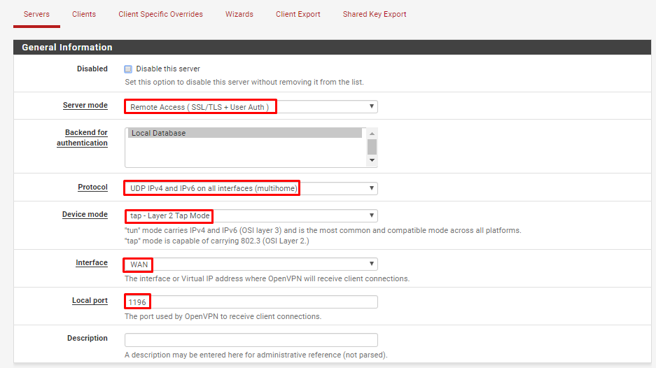

- Khai báo các thông tin về mã hóa

  - TLS Configuration: chọn sử dụng TLS key
  - Peer Certificate Authority: chọn CA cho hệ thống đã tạo trước đó (server-ca)
  - Server certificate: chọn cert cho server được tạo (server-cert)
  - Enable NCP: lựa chọn sử dụng mã hóa đường truyền giữa Client và Server, sử dụng các giải thuật mặc định là AES-256-GCM và   - AES-128-GCM
  - Auth digest algorithm: lựa chọn giải thuật xác thực kênh truyền là SHA256

  
  

- Khai báo các thông tin về tap

  - Bridge DHCP: cho phép client nhận IP trong LAN thông qua DHCP Server
  - Bridge Interface: lựa chọn LAN được kết nối qua VPN
  - IPv4 local Network: khai báo dải mạng được truy cập thông qua VPN (LAN2)
  - Concurrent Connection: khai báo số lượng client được kết nối VPN đồng thời

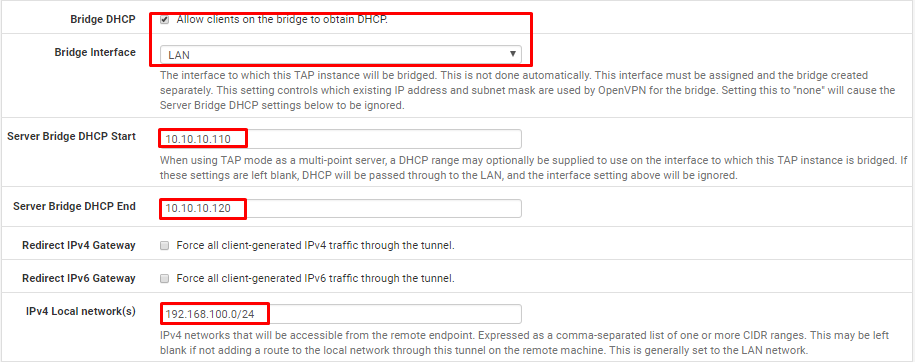

- Khai báo Private LAN được route thông qua tunnel network và Click "Save" để tạo VPN Server

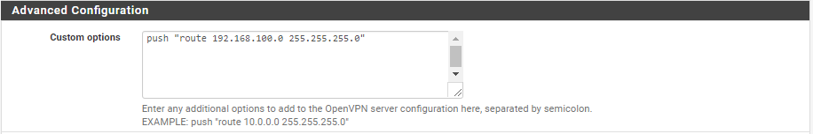

**Cấu hình Interface**

- Tại tab Interfaces/InterfaceAssignments, add thêm network port của VPN, đặt tên là vpn

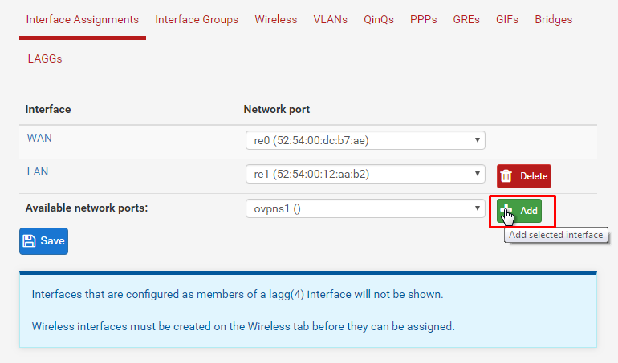

- Sửa lại các option của interface vpnlab như sau

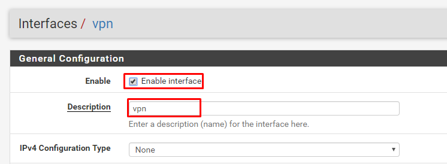

- Tại tab Interfaces/Bridges, tạo bridge mới và add 2 interface VPN và LAN vào bridge

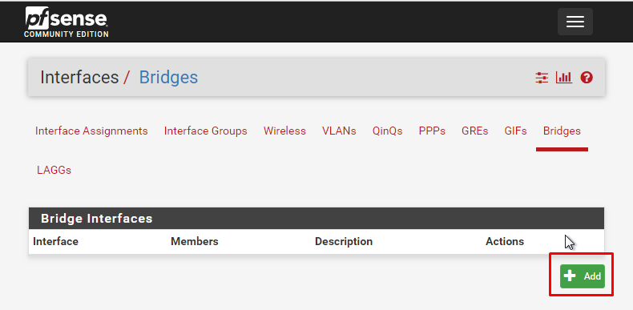
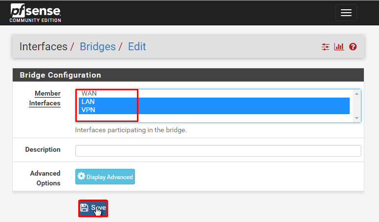

**Cấu hình firewall**

- Tại tab Firewall/Rules/WAN, add thêm rule cho phép client kết nối tới port 1196 của VPN Khai báo các thông số như hình

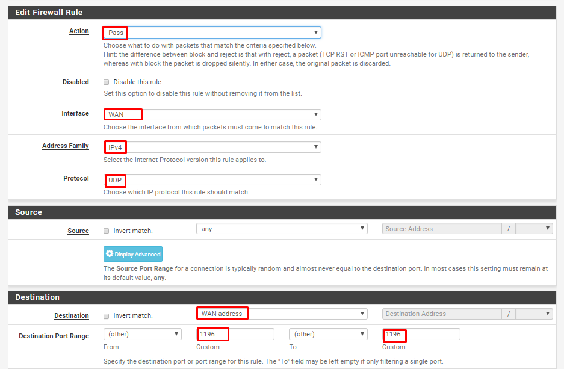

- Tại tab Firewall/Rules/VPN, add rule cho phép lưu lượng đi qua

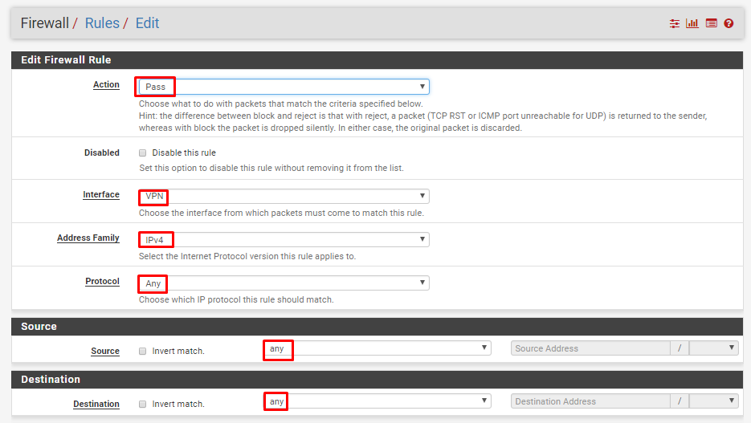

- Tại tab Firewall/Rules/LAN, add rule cho phép lưu lượng đi qua

- Tại tab Firewall/Rules/OPENVPN, add rule cho phép lưu lượng đi qua

**Export OpenVPN config**

- Tại tab VPN/OpenVPN/ClientExport, khai báo các thông số:
  - Remote Access Server: lựa chọn OpenVPN server
  - Hostname Resolution: lựa chọn khai báo IP của WAN !

- Tải gói dùng để vpn về máy

- Tiến hành vpn tới và xem ip được nhận sau đó ping thử tới các host trong cùng dải mạng

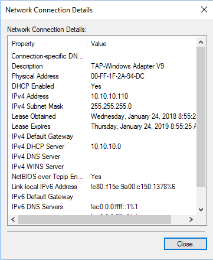
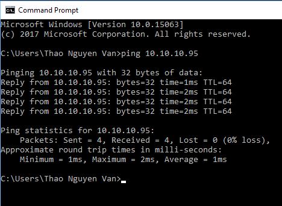
