# Hướng dẫn cấu hình openvpn mode tun

## Mô hình


- Môi trường lab: KVM

## Hướng dẫn cấu hình server

- Truy cập vào giao diện web của pfsense

**Tạo certificate**

- Tại tab System/Certificate Manager/CA, chọn `Add` để thêm một CA mới, CA này sẽ xác thực tất cả các certificate của server VPN và user VPN khi kết nối tới PFSense OpenVPN.

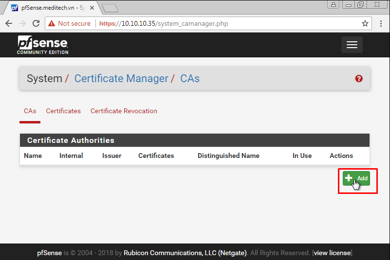

- Điền thông tin vào như trong hình sau đó save lại

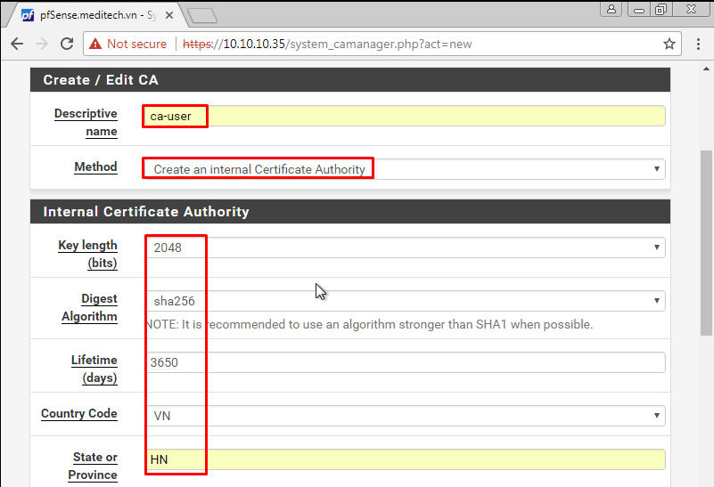

- Tại tab System/Certificate Manager/Certificate, tạo certificate cho server VPN

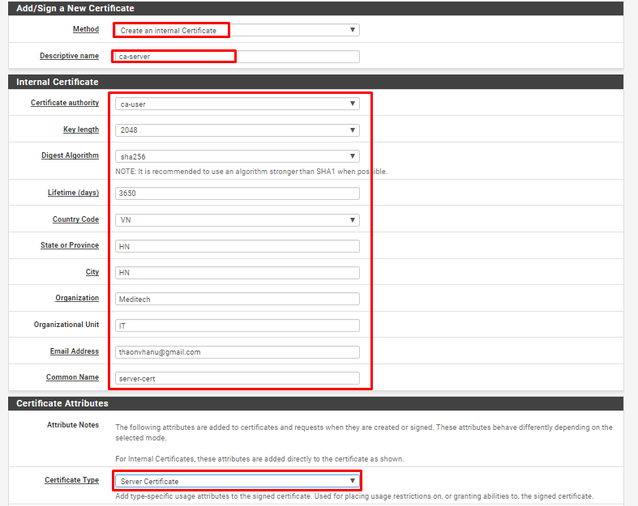

- Tại tab System/UserManager, tạo user được VPN


- Khai báo Username, password của User. Sau đó click vào `Click to create a user certificate`, điền thông tin và save lại

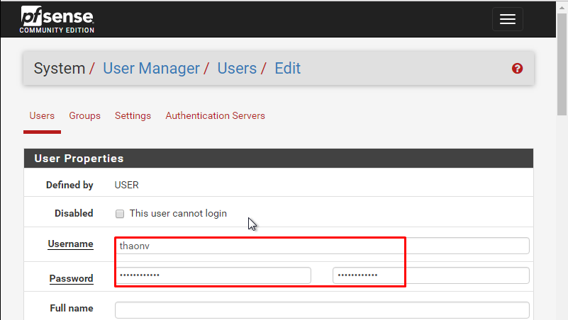
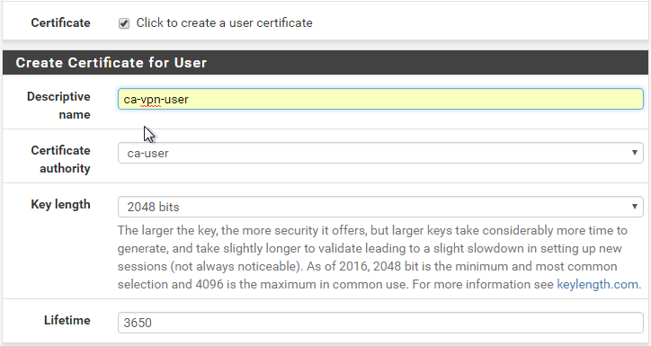

**Tạo VPN Server**

- Tại tab System/Package Manager, cài đặt Plugin openvpn-client-export

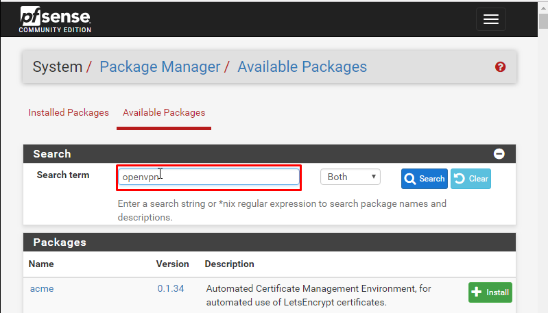
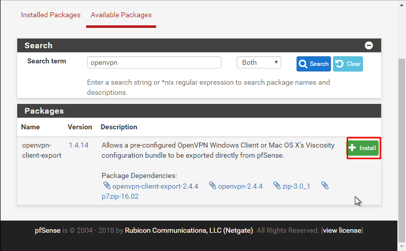

- Chọn `Confirm` và chờ đợi package được cài đặt

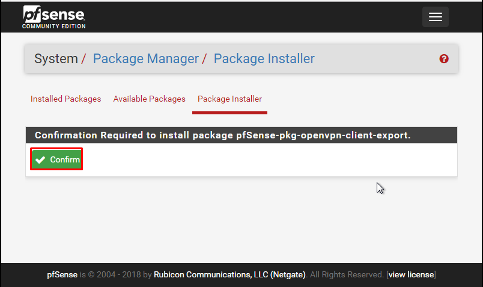
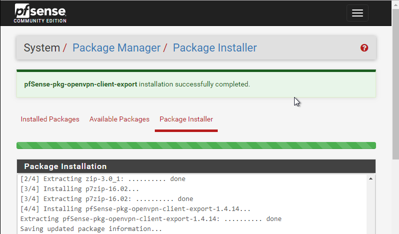

- Tại tab VPN/OpenVPN/Servers, click "Add" để tạo VPN server

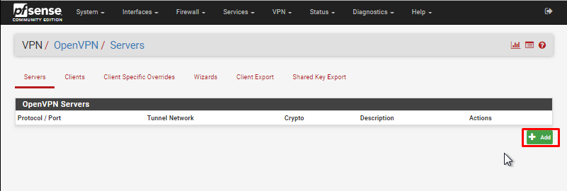

- Khai báo các thông tin về mode kết nối:

  - Server mode: Remote Access (SSL/TLS + User Auth)
  - Device mode: tun
  - Interface: WAN
  - Local port: 1194 (tùy ý lựa chọn port)

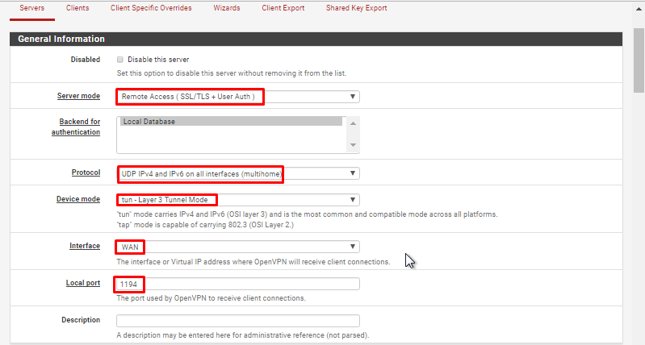

- Khai báo các thông tin về mã hóa

  - TLS Configuration: chọn sử dụng TLS key
  - Peer Certificate Authority: chọn CA cho hệ thống đã tạo trước đó (server-ca)
  - Server certificate: chọn cert cho server được tạo (server-cert)
  - Enable NCP: lựa chọn sử dụng mã hóa đường truyền giữa Client và Server, sử dụng các giải thuật mặc định là AES-256-GCM và   - AES-128-GCM
  - Auth digest algorithm: lựa chọn giải thuật xác thực kênh truyền là SHA256

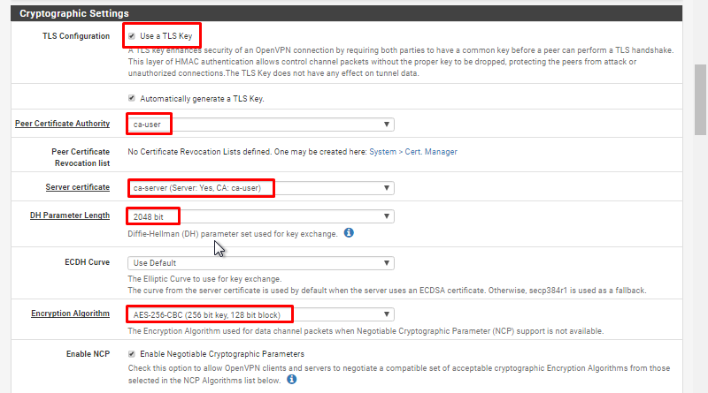
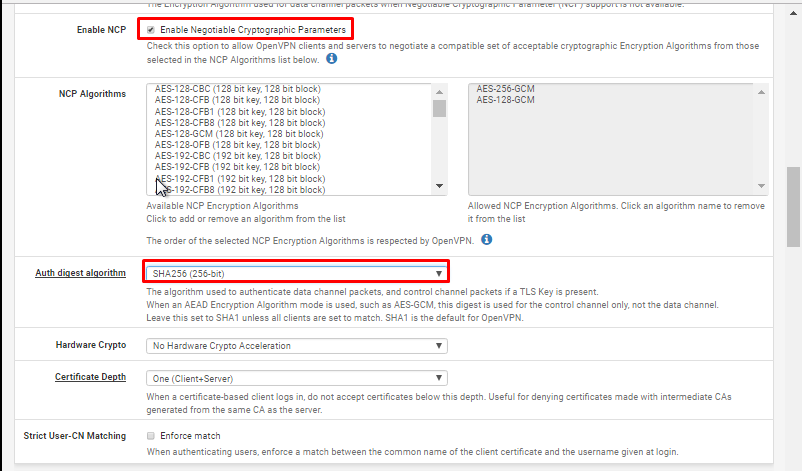

- Khai báo các thông tin về tun

  - IPv4 Tunnel Network: khai báo network tunnel, VPN client sẽ được route tới Private LAN thông qua network này
  - IPv4 local Network: khai báo các dải Private LAN được truy cập thông qua VPN
  - Concurrent Connection: khai báo số lượng client được kết nối VPN đồng thời

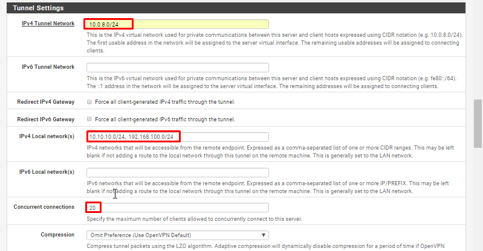

- Khai báo Private LAN được route thông qua tunnel network và Click "Save" để tạo VPN Server

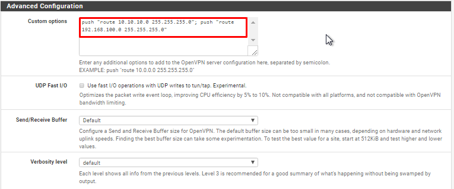

**Cấu hình firewall**

- Tại tab Firewall/Rules/WAN, add thêm rule cho phép client kết nối tới port 1194 của VPN Khai báo các thông số như hình

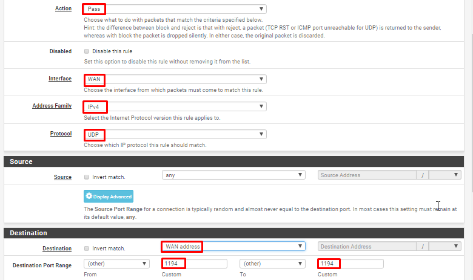

- Tại tab Firewall/Rules/LAN, add rule cho phép lưu lượng đi qua

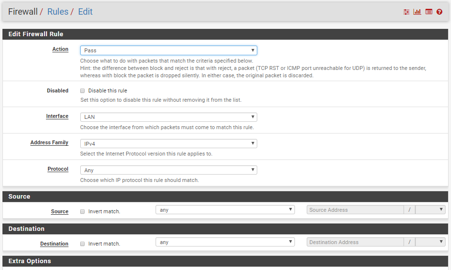

- Tại tab Firewall/Rules/OPENVPN, add rule cho phép lưu lượng đi qua

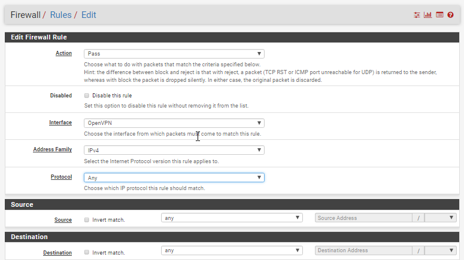

**Export OpenVPN config**

- Tại tab VPN/OpenVPN/ClientExport, khai báo các thông số:
  - Remote Access Server: lựa chọn OpenVPN server
  - Hostname Resolution: lựa chọn khai báo IP của WAN !

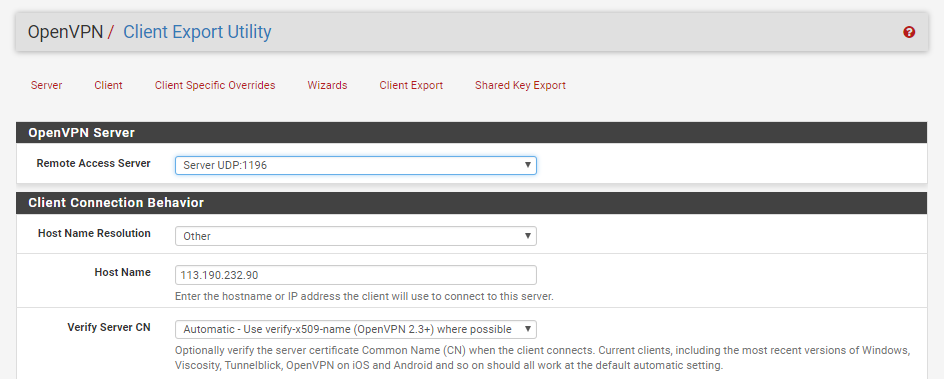

- Tải gói dùng để vpn về máy

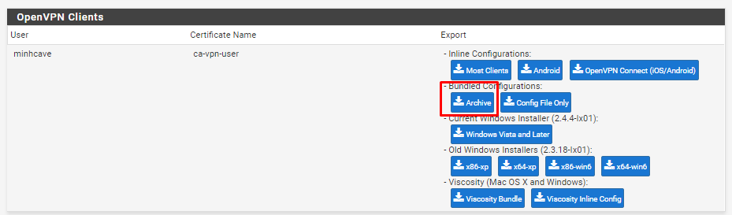

**Đối với các server bên trong LAN**

Trên các server trog LAN phải định tuyến về dải tunnel 10.0.8.0/24 thông qua IP LAN của PFSense, trong VD này, card eth1 của server_target kết nối với dải Private LAN của VPN

`ip route add 10.0.8.0/24 via 10.10.10.95 dev eth1`

Kiểm tra:

`route -n`

Kết quả:

``` sh
Destination     Gateway         Genmask         Flags Metric Ref    Use Iface
0.0.0.0         192.168.2.1     0.0.0.0         UG    0      0        0 eth0
10.0.0.0        20.20.20.90     255.255.255.0   UG    0      0        0 eth1
```
