# Hướng dẫn cài đặt pfsense

- Môi trường lab: KVM
- Công cụ cài đặt: virt-manager

**Tạo máy ảo với 2 card mạng (1 Bridge + 1 Host-only)**

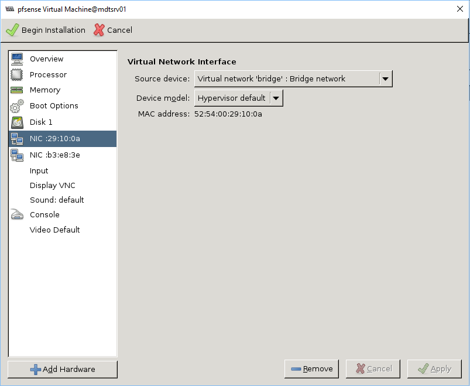

- Sau khi khởi động VM

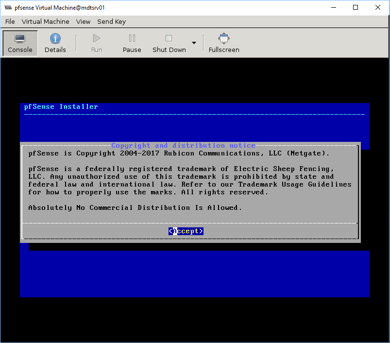

- Lựa chọn các cấu hình cho pfsense

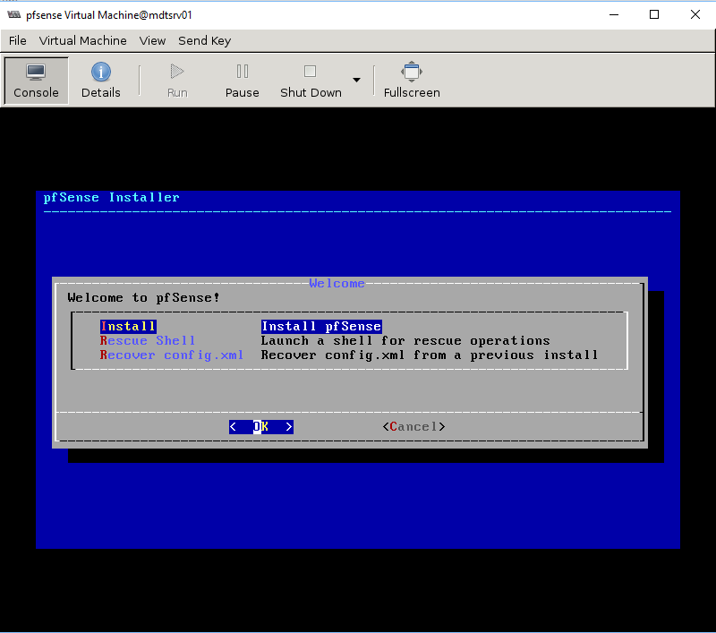
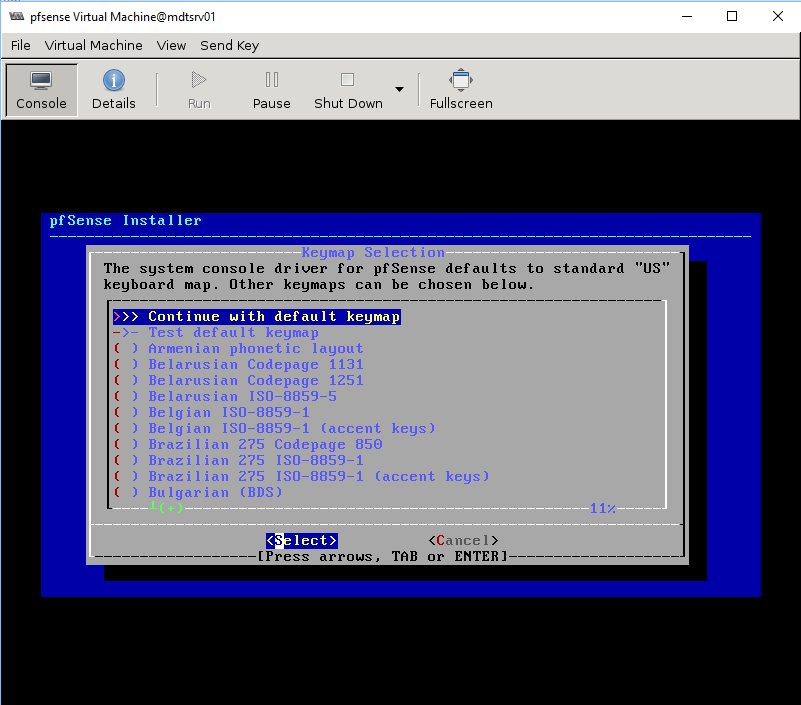
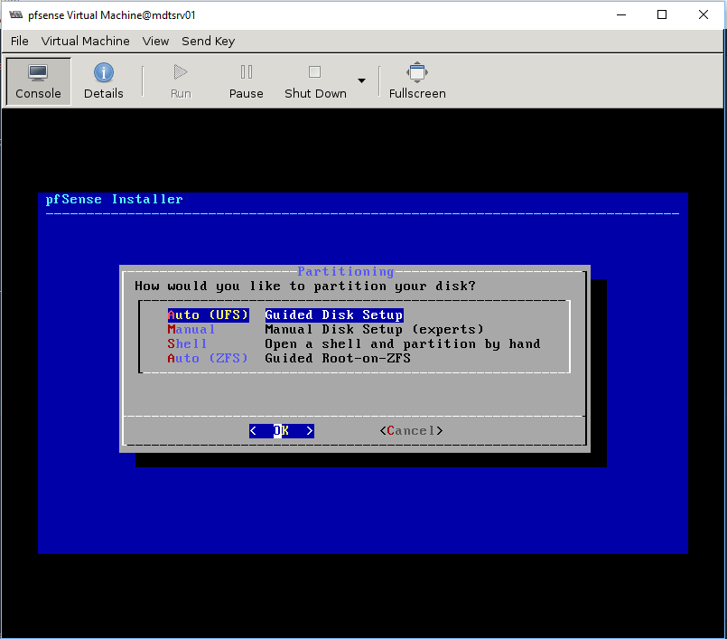
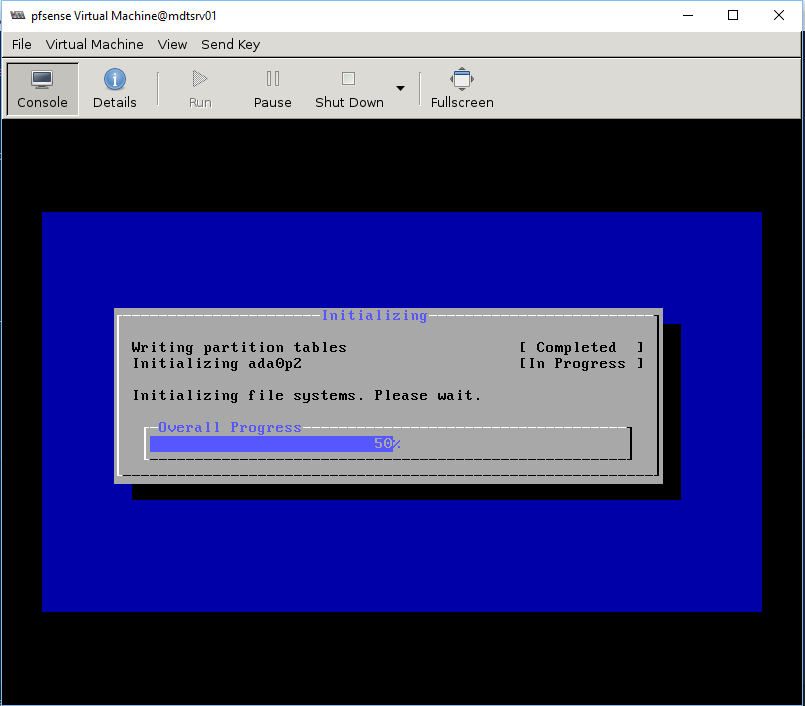

- Khởi động lại VM

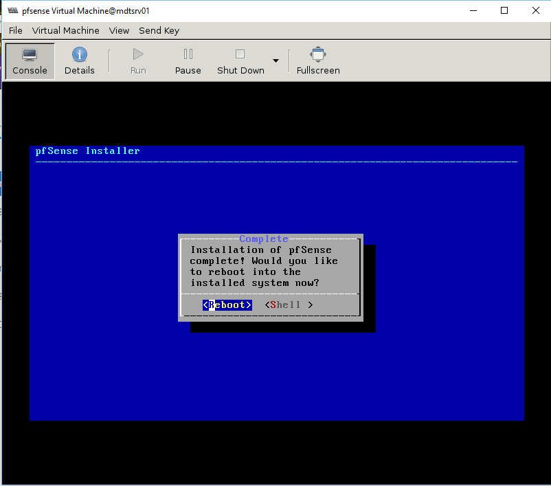

**Cấu hình card mạng**

- Chọn không cấu hình VLANs

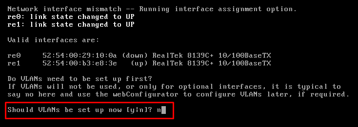

- Chọn card mạng cho WAN và LAN (mặc định PFSense shell chỉ cho phép khai báo 1 card LAN, card LAN2 sẽ khai báo trên PFsense web)

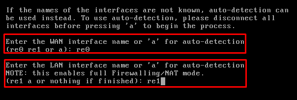

- Xác nhận thông tin card mạng và chọn 'y'

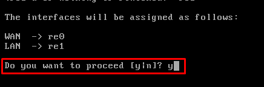

- Sau khi cấu hình, card WAN sẽ tự nhận cấu hình DHCP nếu có, chọn `2` để nhập cấu hình ip tĩnh

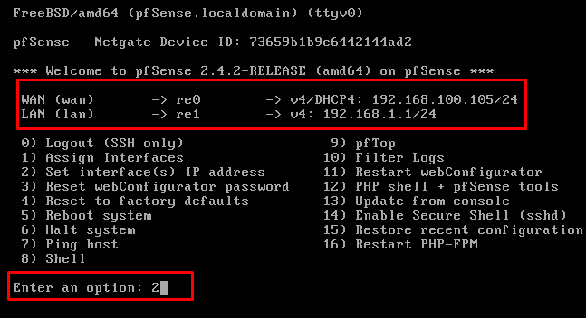

- Cấu hình IP cho card mạng WAN như sau (từ trên xuống dưới)

  - Chọn '1' để set IP cho IP WAN
  - Chọn 'no' để không nhận IP từ DHCP
  - Đặt IP tĩnh
  - Đặt subnet mask
  - Đặt Gateway
  - Chọn 'no' để không nhận IP từ DHCPv6
  - 'Enter' để không đặt IPv6

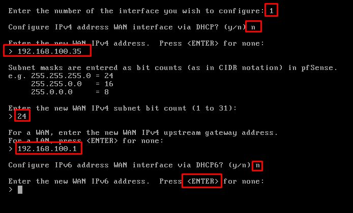

- Cấu hình IP cho card mạng LAN, thực hiện tương tự như WAN. Lưu ý: không đặt gateway và IPv6 cho card LAN

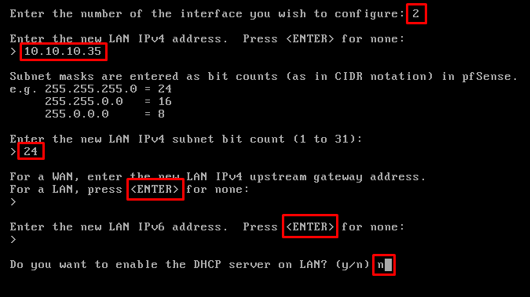

- Truy cập vào pfsense thông qua ip LAN thông qua web browser với username/password là `admin/pfsense`
